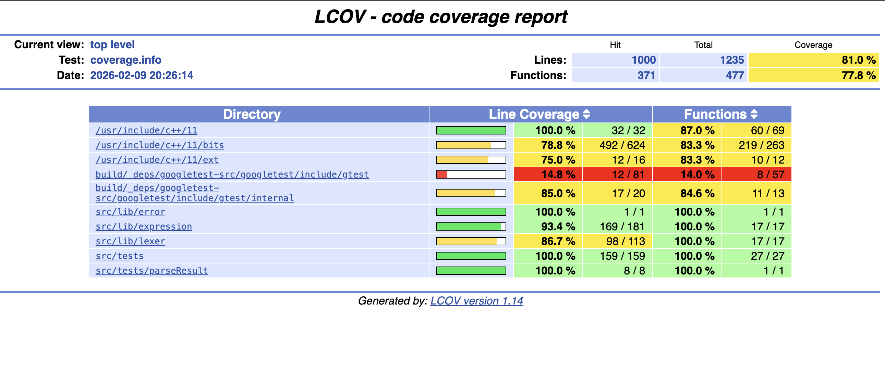

```1) Грамматика:```
```
S -> eps
S -> T
S -> S or T

T -> F
T -> T xor F

F -> M
F -> F and M

M -> not M
M -> letter
M -> (S)
```
В принципе все бинарные операции ассоциативны, 
так что здесь неважно какую ассоциативность взять
но я взял левую, чтобы все осталось по канону ЯП.

---

Теперь устраним левую рекурсию:
```
S_ -> eps
S_ -> S

S  -> T S'
S' -> or T S'
S' -> eps

T  -> F T'
T' -> xor F T'
T' -> eps

F  -> N F'
F' -> and N F'
F' -> eps

N  -> not N
N  -> C

C  -> M C'
C' -> == M C'
C' -> eps

M  -> letter
M  -> (S)
```
---
```NB:```
    Если брать изначально операции правоассоциативными,
то левой рекурсии не будет, но так неинтересно.

---

```2) Токены:```
|           |                |
|-----------|----------------|
|   LPAREN  | "("            |
|   RPAREN  | ")"            |
|   LETTER  | [a-z] \| [A-Z] |
|   NOT     | "not"          |
|   AND     | "and"          |
|   XOR     | "xor"          |
|   OR      | "or"           |
|   END     | "eps"          |

Операции расставлены по приоритету

---

```3)```
+--------------+-------------------------+--------------------------+
|  Нетерминал  |    FIRST                |    FOLLOW                |
+--------------+-------------------------+--------------------------+
|   S_         |    (, letter, not, eps  |  $                       |
|   S          |    (, letter, not       |  $, )                    |
|   S'         |    or, eps              |  $, )                    |
|   T          |    (, letter, not       |  $, or, )                |
|   T'         |    xor, eps             |  $, or, )                |
|   F          |    (, letter, not       |  $, xor, or, )           |
|   F'         |    and, eps             |  $, xor, or, )           |
|   N          |    (, letter, not       |  $, and, xor, or, )      |
|   C          |    (, letter            |  $, and, xor, or, )      |
|   C'         |    ==, eps              |  $, and, xor, or, )      |
|   M          |    (, letter            |  $, ==, and, xor, or, )  |
+--------------+-------------------------+--------------------------+
---

```4) Тесты:```

Использовал ```gtest```

Исходники: ```${CMAKE_CURRENT_LIST_DIR}/tests/tests.cpp```

Идея: подать на вход строчку, построить, затем обойти дерево леворекурсивным спуском и вывести по факту ту же строчку, что была на входе.

> #### Инструкция:
>
> - В ```${CMAKE_CURRENT_LIST_DIR}/build/``` собрать проект
> - ```make parser-tests```
> - ```./parser-tests```

---

#### Покрытие:

```
Overall coverage rate:
  lines......: 81.0% (1000 of 1235 lines)
  functions..: 77.8% (371 of 477 functions)
```
<figure>
  
  <figcaption>В принципе я доволен, большинство строк библиотеки покрывается тестами</figcaption>
</figure>

> #### Инструкция:
>
> - ```cmake -DENABLE_COVERAGE=ON ..```
> - ```make -j```
> - ```./parser-tests```
> - ```lcov --capture --directory . --output-file coverage.info```
> - ```genhtml coverage.info --output-directory coverage-html```

---

Just a remark for myself:

```Shift``` + ```Option``` + ```F``` to format